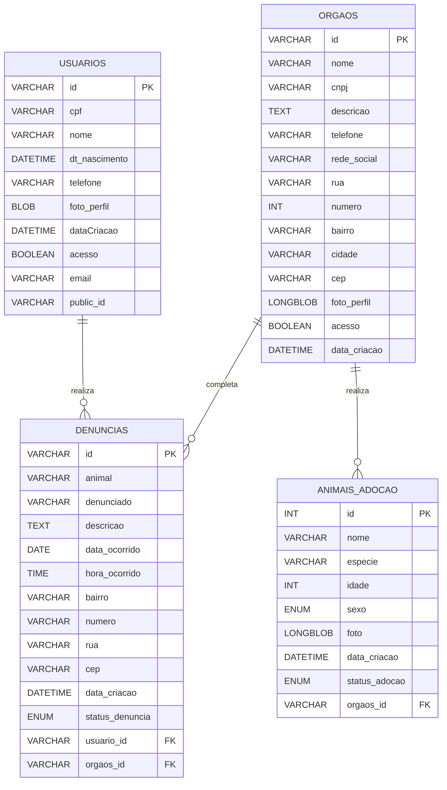

=======
# 🐾 S.O.S Fauna

O S.O.S Fauna é uma plataforma dedicada ao combate aos maus-tratos contra animais. Esta é a versão inicial do projeto (v1), que segue em constante evolução para oferecer melhorias contínuas.

### 🛠️ Banco de dados - Diagrama Entidade Relacionamento

## 🌟 Colaboradores

### 💻 Backend

#### Arthur Moura  
[🔗 Linkedin](https://www.linkedin.com/in/arthur-moura-20462524b/) | [🐙 Github](https://github.com/ArthurMouraa)

#### Luiz Filipe  
[🔗 Linkedin](https://www.linkedin.com/in/luiz-felipe-35265b1a8/) | [🐙 Github](https://github.com/fluizz00)

#### Maycon Gabriel  
[🔗 Linkedin](https://www.linkedin.com/in/maycon-gabriel-388421214/) | [🐙 Github](https://github.com/May154)

#### Armando Alves  
[🔗 Linkedin](https://www.linkedin.com/in/armando-alves-878356151/) | [🐙 Github](https://github.com/ArmandoMartins1)

#### Tallys Labanca  
[🔗 Linkedin](https://www.linkedin.com/in/tallys-labanca/) | [🐙 Github](https://github.com/helelys)

